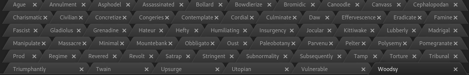

# manytab

Clean multiline tabs in Atom.

Tabs automatically size to file name.

Supports the [Atom][atom], [One][one], [Material][material], [Unity][unity],
[Nucleus][nucleus], and [Seti][seti] themes.

[atom]: https://atom.io/themes/atom-dark-ui
[one]: https://atom.io/themes/one-dark-ui
[material]: https://atom.io/themes/atom-material-ui
[unity]: https://atom.io/themes/unity-ui
[nucleus]: https://atom.io/themes/nucleus-dark-ui
[seti]: https://atom.io/themes/seti-ui

